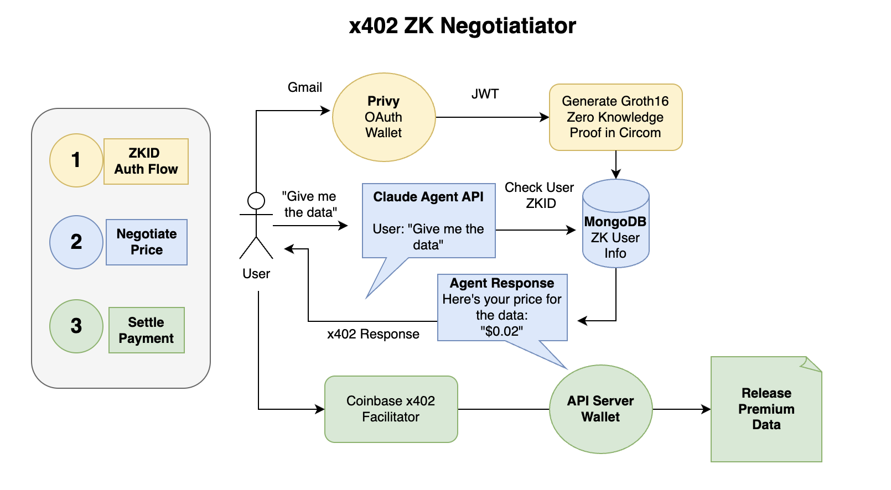

# ZK Payment Negotiator

**Identity-aware payments, privacy-first.**

Jay Yu, Sophia Dew, Mahi Jariwala, Bek Hamit

An AI-powered payment system where your identity determines your price — but your identity stays private.



---

## Overview

ZK Payment Negotiator combines zero-knowledge proofs with the HTTP 402 payment protocol to enable privacy-preserving, identity-aware pricing.

Users authenticate with Google and receive a zero-knowledge proof verifying their email domain (e.g., `@stanford.edu`, `@enterprise.com`) without exposing their actual email. This cryptographic proof feeds into an AI negotiation agent that dynamically prices content based on verified organizational affiliation: students get discounts, enterprises pay premium rates, partners unlock special deals.

When a price is agreed, payment settles instantly via the x402 protocol using USDC on Base.

**The server knows *what* you are, never *who* you are.**

---

## How It Works

1. **Authenticate** — Sign in with Google via Privy. An embedded wallet is created for you.

2. **Generate ZK Proof** — A zero-knowledge proof binds your wallet to your email domain without revealing your identity.

3. **Negotiate** — Chat with the AI agent to request premium content. Your verified domain determines your price tier.

4. **Pay & Access** — Accept the offer, pay with USDC via x402, and unlock your content. Transaction settles on-chain.

---

## Tech Stack

- **Frontend**: Next.js, React, TypeScript
- **Backend**: Express.js, MongoDB Atlas
- **Authentication**: Privy (Google OAuth + embedded wallets)
- **ZK Proofs**: Circom, snarkjs, Groth16
- **Payments**: x402 protocol, USDC on Base Sepolia
- **AI**: Claude (Anthropic) with tool use for agentic negotiation

---

## Setup

### Prerequisites
- Node.js 18+
- pnpm (`npm install -g pnpm`)
- Privy account (https://dashboard.privy.io)

### 1. Configure Privy

1. Create an app at https://dashboard.privy.io
2. Enable Google OAuth in Login Methods
3. Add `http://localhost:3000` to Allowed Origins
4. Copy your App ID

### 2. Set Environment Variables

```bash
cp frontend/.env.example frontend/.env.local
cp backend/.env.example backend/.env
# Edit both files with your API keys
```

### 3. Run the Project

```bash
make          # Install deps and start
```

### 4. (Optional) Enable Real ZK Proofs

To generate cryptographically valid proofs that can be verified on-chain:

```bash
# Install circom first
brew install circom    # macOS
# Or: https://docs.circom.io/getting-started/installation/

# Build circuits
make circom
```

After running `make circom`, the app automatically detects the circuit files and generates real proofs.

### 5. Stop Services

```bash
make stop
```

---

## ZK Proof Modes

### Mock Mode (Default)
- **No circom required**
- Generates proof structure with random values
- Public signals use real Poseidon hashes
- Good for development and testing UI

### Real Mode (Optional)
- **Requires circom installed**
- Run `make circom` to compile circuits
- Generates cryptographically valid Groth16 proofs
- Proofs can be verified on-chain

The app automatically detects which mode to use based on whether circuit files exist in `frontend/public/zk/`.

---

## Project Structure

```
x402-zkid/
├── Makefile              # Build orchestration
├── package.json          # Root package
├── circuits/             # ZK circuits (optional)
│   ├── jwt_domain_verifier.circom
│   └── build.js          # Circuit compiler
├── frontend/             # Next.js app
│   ├── app/
│   │   ├── page.tsx      # Main page
│   │   ├── layout.tsx    # Root layout
│   │   └── globals.css   # Styles
│   ├── lib/
│   │   ├── zkproof.ts    # Dual-mode proof generation
│   │   ├── api.ts        # Backend API client
│   │   └── x402client.ts # x402 payment client
│   └── components/
│       └── Providers.tsx # Privy wrapper
└── backend/              # Express.js API
    └── src/
        ├── index.ts      # Server entry
        ├── agent/        # AI negotiation agent
        └── x402/         # Payment handling
```

---

## Public Signals

The ZK proof exposes three public signals:
- `domainHash`: Poseidon hash of the email domain
- `nullifier`: Unique identifier (domain + secret)
- `walletBinding`: Hash binding wallet to domain

---

## Ports
- Frontend: http://localhost:3000
- Backend: http://localhost:3001

---

## License

MIT
